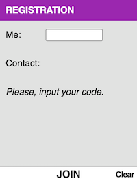
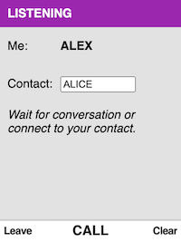
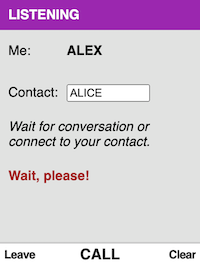

## Audio Call via WebRTC: React Application for KaiOS

Based on [PEER JS](https://peerjs.com/peerserver.html) library.

#### Create an empty npm project for local peer server:
```json
{
  "name": "peerjs-server",
  "version": "1.0.0",
  "description": "",
  "main": "index.js",
  "scripts": {
    "start": "peerjs --port 9000 --path /web-phone --allow_discovery"
  },
  "author": "",
  "license": "ISC",
  "dependencies": {
    "peer": "^0.6.1"
  }
}
```

#### Start peer server:
- `npm start`

#### Get peer list:
- `http://127.0.0.1:9000/web-phone/peerjs/peers`

#### Run application in dev mode:
- `yarn start`

#### Build application for deployment:
1. Edit file `src/config.js`
2. Run `yarn build`
3. Deploy `build` folder to the device.

---

### Prebuilt code
Download [prebuilt code](https://downgit.github.io/#/home?url=https://github.com/iurii-kyrylenko/kaios-web-phone/tree/master/build), unzip it and install on your device.

⚠️  Audio streams go directly between phones. But we also need a signalling server. Prebuilt code currently works with a free [PeerServer Cloud service](https://peerjs.com/peerserver.html). Please be aware that you will be sharing it with other people and IDs may collide.

---

## Usage

The conversation can be established by you or by your contact:
1. To receive a call, you provide only your ID and wait for conversation. Conversation begins when somebody calls you.
2. To begin a conversation, you enter two IDs (yours and contact's) and perform a call.

Application has three screens:
1. **Registration**:
  - to provide your ID and enter the listening state.
2. **Listening**:
  - to wait for incoming call;
  - or to start conversation with your contact.
3. **Conversation**:
  - to talk with the contact.

---

**During registration, you will get a message**:
```
Would you like to share your camera and microphone with KaiOS Web Phone?
```
**Please, allow sharing!**

---

### Example: Alex call Alice.

| Alex          | Alice         |
| ------------- | ------------- |
| Alex enters the application:|
||
| Alex inputs his ID:|
|
| Alex presses **Join**:|
||
| Alex inputs Alice's ID:|
||
| Alex presses **Call**:|
||
| Alex remains listening,</br>because Alice has not registered yet:|
||
||Alice registers:|
|||
| Alex presses the **Call** again<br/>after Alice has registered.<br/>Alex can talk to Alice:|Alice can talk to Alex:|
|||
